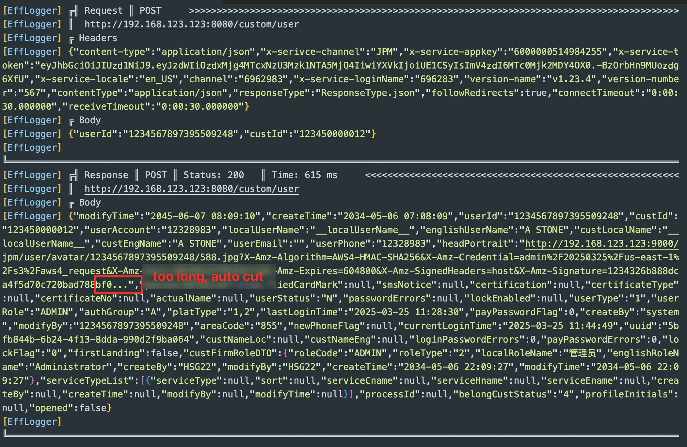

# Efficient Dio Logger

Dio interceptor: Not Pretty, but Efficient Dio Logger

For projects using `Dio` and containing a large number of requests:
- lineWidth configures the maximum length of a single line log
- maxWidth configures the maximum length of a single request/return value, which will be truncated if exceeded
- compact turns on maxWidth truncation function

适用于使用`Dio`并且包含大量请求的的项目:
- lineWidth 配置单行日志最大长度
- maxWidth 配置单个请求/返回的value的最大长度, 超过将被截断
- compact 开关maxWidth截断功能


## Installation
```bash
dart pub add efficient_dio_logger
```

## Usage

```dart
main() {
  Dio dio = Dio();
  dio.interceptors.add(EfficientDioLogger());

  // or customization:
  dio.interceptors.add(EfficientDioLogger(
    request: true,
    requestHeader: true,
    requestBody: true,
    responseHeader: false,
    responseBody: true,
    error: true,
    // set your console width
    lineWidth: 160,
    // set max content text length (Recommended use lineWidth*2)
    maxWidth: 320,
    // if true, value that has more than maxWidth(=320) characters will be truncated
    compact: true,
    // or use 'print'
    logPrint: (l) => log('$l', name: 'EffLogger'),
    enabled: kDebugMode,
    filter: (options, args) {
      // don't print requests with uris containing '/posts'
      if (options.path.contains('/posts')) {
        return false;
      }
      // don't print responses with unit8 list data
      // else, if compact=true, Uint8 list will be printed as 'Uint8List(length: maxWidth)'
      if (args.isResponse && args.hasUint8ListData) {
        return false;
      }
      return true;
    },
  ));
}
```

## Look like


## Meagre with PrettyDioLogger

```dart
import 'package:efficient_dio_logger/efficient_dio_logger.dart';

typedef PrettyDioLogger = EfficientDioLogger;
```